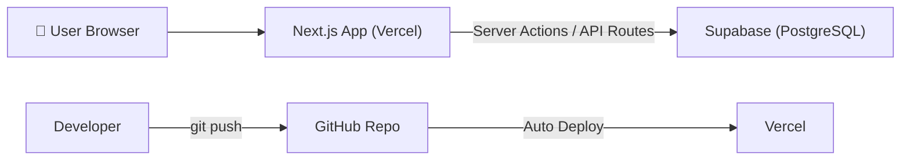
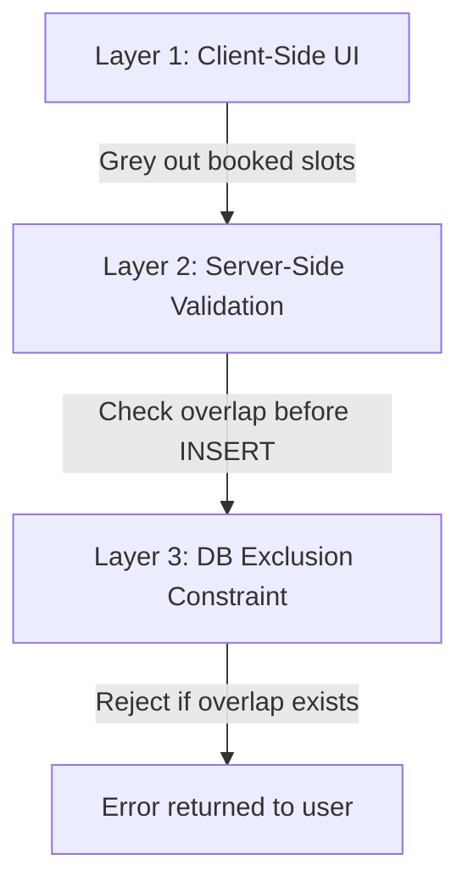
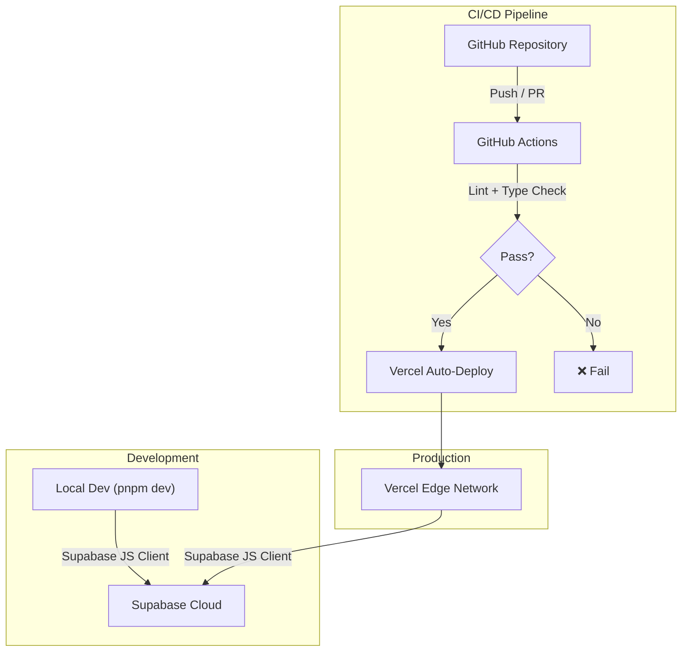
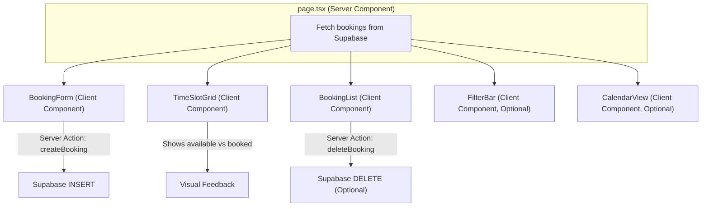
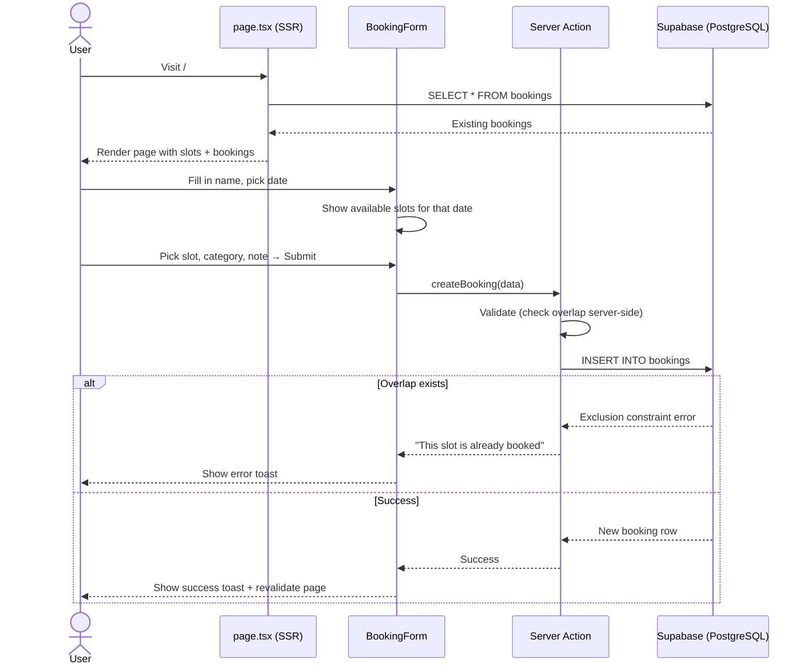

# Time Slot Booking Web Application — System Architecture

## 1. Overview

A single-page web application that allows users to book available time slots. Already-booked slots are visually distinguished and cannot be double-booked. No authentication is required.



---

## 2. Tech Stack

| Layer | Technology | Rationale |
|-------|-----------|-----------|
| **Framework** | Next.js 15 (App Router) | You already know it; SSR + API routes in one project |
| **Language** | TypeScript | Type safety, better DX, good eval impression |
| **Styling** | Tailwind CSS v4 | Rapid UI development, responsive out of the box |
| **Database** | Supabase (PostgreSQL) | You already know it; free tier, hosted, instant REST API |
| **ORM / Client** | Supabase JS Client (`@supabase/supabase-js`) | Direct integration, no extra ORM needed |
| **Deployment** | Vercel | Native Next.js support, free tier, auto deploys |
| **CI / Linting** | GitHub Actions | You already know it; lint + type-check on push |
| **Package Manager** | pnpm | Fast, disk-efficient |

> [!NOTE]
> This stack keeps things simple — a single Next.js project with Supabase as the backend. No separate FastAPI server or Docker needed for this scope. That said, the architecture is clean enough that you can confidently explain every layer in the interview.

---

## 3. Folder / File Structure

```
Recruitment Task/
├── docs/
│   └── RotaractMora_IT_Recruitment_Task.md   # Task specification
│
├── src/
│   ├── app/
│   │   ├── layout.tsx                        # Root layout (fonts, metadata, providers)
│   │   ├── page.tsx                          # Main dashboard / booking page
│   │   ├── globals.css                       # Tailwind directives + custom CSS
│   │   ├── loading.tsx                       # Suspense fallback skeleton
│   │   └── api/
│   │       └── bookings/
│   │           └── route.ts                  # REST API: GET (list) + POST (create)
│   │
│   ├── components/
│   │   ├── BookingForm.tsx                   # Form: name, date, time slot, category, note
│   │   ├── TimeSlotGrid.tsx                  # Visual grid of available / booked slots
│   │   ├── BookingList.tsx                   # Table / card list of existing bookings
│   │   ├── CalendarView.tsx                  # (Optional) Simple calendar view
│   │   ├── FilterBar.tsx                     # (Optional) Filter by date / category / time
│   │   └── ui/                              # Reusable primitives (Button, Badge, Card, etc.)
│   │       ├── Button.tsx
│   │       ├── Badge.tsx
│   │       ├── Card.tsx
│   │       ├── Input.tsx
│   │       ├── Select.tsx
│   │       └── Toast.tsx
│   │
│   ├── lib/
│   │   ├── supabase/
│   │   │   ├── client.ts                    # Browser Supabase client (createBrowserClient)
│   │   │   └── server.ts                    # Server Supabase client (createServerClient)
│   │   ├── types.ts                         # TypeScript types / interfaces (Booking, TimeSlot)
│   │   ├── constants.ts                     # Time slot definitions, categories, config
│   │   └── utils.ts                         # Helpers (date formatting, slot overlap check)
│   │
│   └── actions/
│       └── bookings.ts                      # Server Actions: createBooking, deleteBooking
│
├── supabase/
│   ├── migrations/
│   │   └── 001_create_bookings_table.sql    # Initial migration
│   └── seed.sql                             # 5 demo booking records
│
├── .github/
│   └── workflows/
│       └── ci.yml                           # Lint + type-check on push/PR
│
├── public/
│   └── favicon.ico
│
├── .env.local                               # NEXT_PUBLIC_SUPABASE_URL, NEXT_PUBLIC_SUPABASE_ANON_KEY
├── .env.example                             # Template for env vars (committed)
├── .gitignore
├── next.config.ts
├── tailwind.config.ts
├── tsconfig.json
├── package.json
├── pnpm-lock.yaml
└── README.md                                # Setup instructions, tech stack, deployed link
```

> [!TIP]
> The `actions/` folder uses **Next.js Server Actions** for mutations (create/edit/delete bookings). The `api/` route is kept as an alternative for `GET` requests or if you prefer a RESTful approach. You can choose one pattern or use both — either is fine for this scope.

---

## 4. Database Schema

A single `bookings` table in Supabase (PostgreSQL):

```sql
-- supabase/migrations/001_create_bookings_table.sql

CREATE TABLE bookings (
  id          UUID DEFAULT gen_random_uuid() PRIMARY KEY,
  name        TEXT        NOT NULL,
  date        DATE        NOT NULL,
  start_time  TIME        NOT NULL,
  end_time    TIME        NOT NULL,
  category    TEXT        NOT NULL,
  note        TEXT,
  created_at  TIMESTAMPTZ DEFAULT now()
);

-- Prevent overlapping bookings on the same date
-- Uses an exclusion constraint with the btree_gist extension
CREATE EXTENSION IF NOT EXISTS btree_gist;

ALTER TABLE bookings
  ADD CONSTRAINT no_overlapping_bookings
  EXCLUDE USING gist (
    date WITH =,
    tsrange(
      ('2000-01-01'::date + start_time)::timestamp,
      ('2000-01-01'::date + end_time)::timestamp
    ) WITH &&
  );

-- Index for fast lookups by date
CREATE INDEX idx_bookings_date ON bookings(date);
```

> [!IMPORTANT]
> The **exclusion constraint** `no_overlapping_bookings` enforces overlap prevention at the **database level**. This is the most robust approach — even if the application logic has a bug, the DB will reject overlapping inserts. This is a strong talking point for the interview (worth **20 marks**).

### TypeScript Types

```typescript
// src/lib/types.ts

export interface Booking {
  id: string;
  name: string;
  date: string;        // ISO date string "2026-08-03"
  start_time: string;  // "09:00:00"
  end_time: string;    // "09:30:00"
  category: string;
  note: string | null;
  created_at: string;
}

export type BookingInsert = Omit<Booking, 'id' | 'created_at'>;

export const CATEGORIES = [
  'Meeting',
  'Interview',
  'Discussion',
  'Important Meeting',
  'Consultation',
] as const;

export type Category = (typeof CATEGORIES)[number];
```

---

## 5. Seed Data

```sql
-- supabase/seed.sql

INSERT INTO bookings (name, date, start_time, end_time, category, note) VALUES
  ('Demo User 1', '2026-08-03', '09:00', '09:30', 'Meeting',           'Project discussion'),
  ('Demo User 2', '2026-08-03', '10:00', '10:30', 'Interview',         'Team interview'),
  ('Demo User 3', '2026-08-04', '13:30', '14:00', 'Discussion',        'Technical discussion'),
  ('Demo User 4', '2026-08-05', '15:00', '15:30', 'Important Meeting', 'Planning meeting'),
  ('Demo User 5', '2026-08-06', '11:00', '11:30', 'Consultation',      'General consultation');
```

---

## 6. API Design

### Option A: Server Actions (Recommended)

```typescript
// src/actions/bookings.ts
'use server'

export async function getBookings(filters?: { date?: string; category?: string }): Promise<Booking[]>
export async function createBooking(data: BookingInsert): Promise<{ success: boolean; error?: string }>
export async function deleteBooking(id: string): Promise<{ success: boolean; error?: string }>
```

### Option B: API Route (RESTful)

| Method | Endpoint | Description |
|--------|----------|-------------|
| `GET` | `/api/bookings?date=2026-08-03&category=Meeting` | List bookings with optional filters |
| `POST` | `/api/bookings` | Create a new booking |
| `DELETE` | `/api/bookings?id=<uuid>` | Delete a booking (optional feature) |

> [!NOTE]
> You can use **Server Actions for mutations** and **RSC (React Server Components) for reads** — this is the idiomatic Next.js 15 approach. The API route is there if you want a clean REST endpoint too.

---

## 7. Overlap Prevention Strategy (Key Feature — 20 marks)

Three layers of protection:



| Layer | What it does |
|-------|-------------|
| **1. Client UI** | Visually disable/grey-out already-booked time slots so users can't even select them |
| **2. Server Validation** | Before inserting, query the DB to check for conflicts; return a friendly error if found |
| **3. DB Constraint** | PostgreSQL exclusion constraint rejects overlapping rows — bulletproof safety net |

---

## 8. 3rd-Party Service Integration



### Supabase

| Item | Detail |
|------|--------|
| **Service** | Supabase (free tier) |
| **Used for** | PostgreSQL database hosting, auto-generated REST API |
| **Client library** | `@supabase/supabase-js` + `@supabase/ssr` |
| **Env vars** | `NEXT_PUBLIC_SUPABASE_URL`, `NEXT_PUBLIC_SUPABASE_ANON_KEY` |
| **RLS (Row Level Security)** | Disabled or set to allow all (no auth in this app) |
| **Setup** | Create project → create `bookings` table → run seed SQL → copy keys |

### Vercel

| Item | Detail |
|------|--------|
| **Service** | Vercel (free Hobby tier) |
| **Used for** | Hosting, edge functions, auto-deploy from GitHub |
| **Integration** | Connect GitHub repo → auto deploys on push to `main` |
| **Env vars** | Set `NEXT_PUBLIC_SUPABASE_URL` and `NEXT_PUBLIC_SUPABASE_ANON_KEY` in Vercel dashboard |
| **Domain** | Auto-generated `*.vercel.app` URL |

### GitHub Actions

| Item | Detail |
|------|--------|
| **Service** | GitHub Actions (free for public repos) |
| **Used for** | CI pipeline — lint + type-check on every push/PR |
| **Config file** | `.github/workflows/ci.yml` |

```yaml
# .github/workflows/ci.yml
name: CI

on:
  push:
    branches: [main]
  pull_request:
    branches: [main]

jobs:
  lint-and-typecheck:
    runs-on: ubuntu-latest
    steps:
      - uses: actions/checkout@v4
      - uses: pnpm/action-setup@v4
        with:
          version: 10
      - uses: actions/setup-node@v4
        with:
          node-version: 22
          cache: pnpm
      - run: pnpm install --frozen-lockfile
      - run: pnpm lint
      - run: pnpm tsc --noEmit
```

---

## 9. Key npm Dependencies

```json
{
  "dependencies": {
    "next": "^15.3",
    "react": "^19.1",
    "react-dom": "^19.1",
    "@supabase/supabase-js": "^2.49",
    "@supabase/ssr": "^0.6"
  },
  "devDependencies": {
    "typescript": "^5.8",
    "@types/react": "^19",
    "@types/node": "^22",
    "tailwindcss": "^4",
    "@tailwindcss/postcss": "^4",
    "eslint": "^9",
    "eslint-config-next": "^15.3"
  }
}
```

> [!NOTE]
> No extra libraries for date pickers, calendars, or UI kits are listed here. You can add them if needed (e.g., `react-day-picker`, `date-fns`), but keeping deps minimal is better for a recruitment task — it shows you can build things yourself.

---

## 10. Page & Component Architecture



### Component Breakdown

| Component | Type | Responsibility |
|-----------|------|---------------|
| `page.tsx` | Server Component | Fetches all bookings, passes data to children |
| `BookingForm` | Client Component (`'use client'`) | Form with name, date, time slot (dropdown), category, note. Calls `createBooking` server action |
| `TimeSlotGrid` | Client Component | Visual grid showing 30-min slots for a selected date. Booked = greyed out. Available = clickable |
| `BookingList` | Client Component | Table/cards showing all bookings. Optional delete button |
| `FilterBar` | Client Component (Optional) | Dropdowns/inputs to filter by date, category, time |
| `CalendarView` | Client Component (Optional) | Mini calendar with dots on dates that have bookings |

---

## 11. User Flow



---

## 12. Evaluation Coverage Map

How this architecture maps to the **100-mark rubric**:

| Criterion | Marks | How this architecture addresses it |
|-----------|-------|------------------------------------|
| Working booking flow | 35 | `BookingForm` → Server Action → Supabase INSERT → revalidate page |
| Duplicate/overlap prevention | 20 | 3-layer strategy: UI disable + server check + DB exclusion constraint |
| UI quality & responsiveness | 15 | Tailwind CSS, responsive grid, micro-animations, toast notifications |
| Code structure & clarity | 10 | Clean folder structure, TypeScript, separated concerns (components/actions/lib) |
| GitHub repo & README | 5 | `.github/workflows/ci.yml`, clear README with setup + tech stack |
| Working deployment | 5 | Vercel auto-deploy from GitHub, env vars configured |
| Interview explanation | 5 | Clear architecture → easy to explain each layer |
| Optional improvements | 5 | `FilterBar`, `CalendarView`, edit/delete actions |

---

## 13. Development Workflow

```
1. pnpm create next-app@latest ./  (with TypeScript, Tailwind, App Router)
2. Set up Supabase project + create bookings table + run seed.sql
3. Add .env.local with Supabase keys
4. Build components: BookingForm → TimeSlotGrid → BookingList
5. Implement server actions (createBooking)
6. Add overlap prevention (all 3 layers)
7. Polish UI (animations, responsive, toast feedback)
8. Add CI workflow (.github/workflows/ci.yml)
9. Connect repo to Vercel → deploy
10. Test deployed app → verify 5 demo records visible
11. (Optional) Add FilterBar, CalendarView, edit/delete
12. Write README
```

---

> [!TIP]
> **Interview tip**: The strongest talking points are the **DB-level exclusion constraint** for overlap prevention (shows real backend understanding) and the **Server Components + Server Actions** pattern (shows modern Next.js knowledge). Be ready to explain both.
